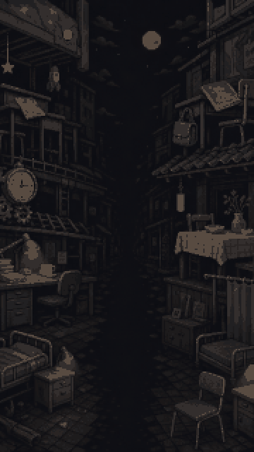
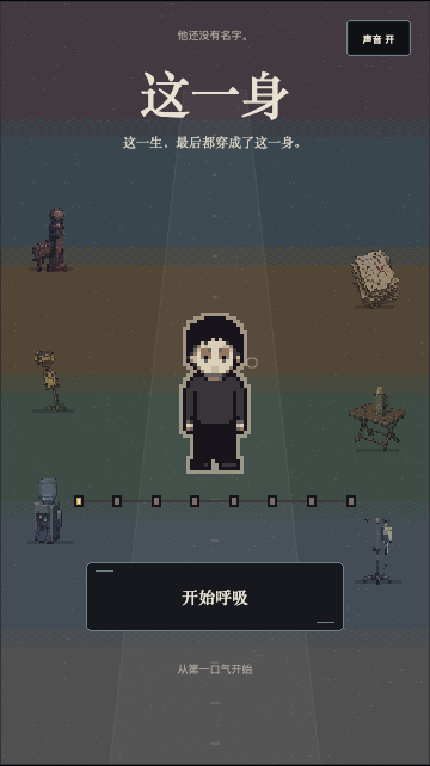
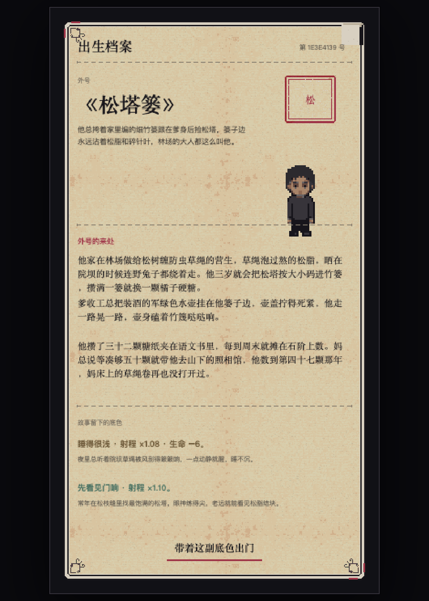
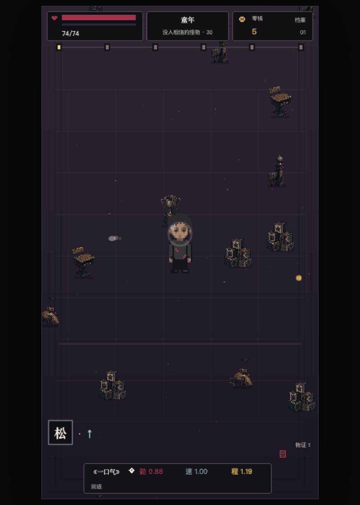
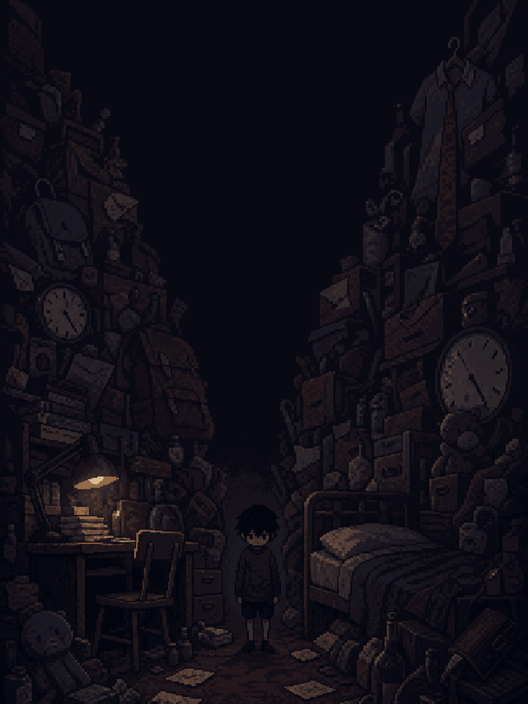
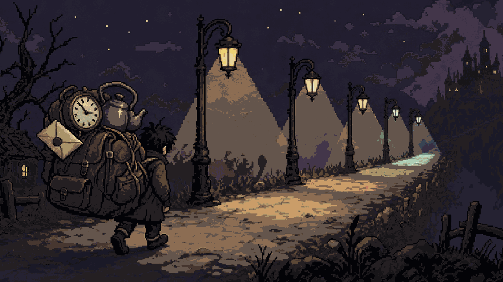
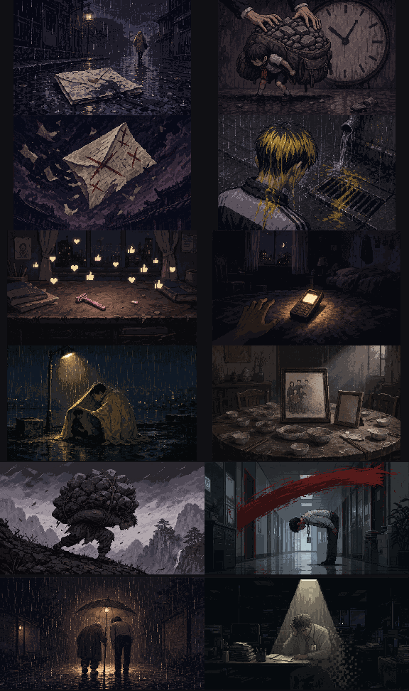

# 这一身

<p align="center">
  
</p>

<p align="center">
  <b>这一生，最后都穿成了这一身。</b>
</p>

<p align="center">
  
  
  
  
  
  
  
</p>

竖屏、自由走位、自动索敌弹道的 **AI-native 人生构筑 Roguelite**。

核心哲学只有一句：**事情是改不了的，怎么做是可以选择的。** 玩家不能改变已经发生的事，只能在命运事件中左滑「咽下」或右滑「吐出」；走位、回应、五毒（贪嗔痴慢疑）和穿戴道具会共同改变唯一攻击《一口气》——它像一团被人生揉捏的橡皮泥，你捡起什么，它就变成什么形状。

故事是一个男人的成长：关卡是他慢慢长大，怪物是从降生到老死遇到的各种困难，道具是困难留下的事物——可穿戴、可叠加、会改变他的外貌。语气是黑暗童话 + 时代梗 + 灰色幽默：道具初看好笑，细想沉默（《断掉的脊梁骨》《同桌的修眉刀》《我一直在哭》）。

## 实机截图

| 开屏 | AI 出生档案 | 战斗 |
| :---: | :---: | :---: |
|  |  |  |

> 中间这张《松塔篓》——林场里给松树缠防虫草绳人家的孩子——是 AI 在截图当下实时生成的，不是预设人物。每一局的出生都是如此。

## 宣传素材

| 3:4 参赛封面 | 16:9 横幅 |
| :---: | :---: |
|  |  |

## 三条设计红线

1. **出生绝无兜底人物。** 每一局的出生故事、童年外号、外貌 DNA、数值底色全部由 AI 实时生成；生成失败就停在重试页，绝不塞示例人物进这一局。代码里的案例只做风格参照。
2. **出生要千奇百怪。** 「家庭底色 × 地域 × 叙事基调 × 外号构词」四个轮盘由代码掷定（种子随机 + 防近局重复），抽定结果交给 AI 执行——把随机性放在有状态的代码里，防止无状态的模型叙事塌缩。
3. **AI 慢可以，但要无感加载。** 等待被包装成「出生登记处」的开场叙事遮罩，档案在路上，玩家在读他的人生。

## 核心特性

- **六章人生关卡**（童年至暮年）、无限地图自由走位、自动索敌攻击；环境摆设随年龄在奔跑中平滑渐变（床底立柱 → 课桌 → 齿轮 → 工位 → 床栏）
- **74 件可穿戴人生道具**，叠加改变外貌、弹体形状、颜色、轨迹与生命周期；道具效果遵循「机制即隐喻」——先有隐喻，数值只是它的影子
- **12 个命名组合彩蛋**：集齐特定道具组合触发专属机制，奥义插画在战场上浮现 3.4 秒
- **协同标签系统**：湿×冰、锋利×骨节、重×爆炸等词条化学反应，首次触发以「成双·」句式报幕
- **写实的生成式命运连续剧**：AI 调用拆成「现实事件核心 → 咽下/吐出回应 → 独立现实审稿 → 文学化呈现 → 事实一致性复审」。事件先用白话讲清时间、地点、人物、动作与直接结果，因果成立后才允许灰色幽默与留白；人生记忆由程序直接从通过审查的正文生成，不能偷加新设定。上一次的选择成为下一次的起因，回应改变五毒与后续构筑
- **当铺 + 随机刷新的留灯间/里屋实体门**（限时存在，走进去触发）：里屋卖代价，留灯间存放被爱过的证据
- **美术管线**：敌怪、场景摆设、道具图标、弹体与命中特效、房间内景、六章地面、卡框与结局画面都走「生图基底 + 程序规整」混合管线；主角人偶纯程序化（形变/穿戴依赖代码控帧）；AI 只能选择白名单模板，不能自由生成图像或数值

<p align="center">
  <br/>
  <sub>十二组合奥义插画 · 集齐的瞬间在战场上浮现</sub>
</p>

## 在线体验

- **演示站**：https://shen.kk666.best/ （demo 构建，AI 走服务端代理）
- **百科**：https://shen.kk666.best/wiki/ （道具志 / 图鉴 / 美术馆，与实机贴图同源）

## 操作

- **战斗**：虚拟摇杆 / WASD 走位，《一口气》自动索敌攻击
- **命运**：左滑「咽下」，右滑「吐出」；键盘 A/← 与 D/→；也可亲口替他写下回应
- **奖励 / 商城 / 特殊房**：点击选择；数字键 1–3 亦可

## 本地开发

```bash
npm install
cp .env.local.example .env.local
# 只在 .env.local 中填写 BLOOD_MOON_AI_API_KEY；该文件已被 Git 忽略
npm run dev
```

对局 AI 通过 Vite 后台代理调用，浏览器和构建产物拿不到密钥。默认走火山方舟直连 `doubao-seed-evolving`（与抖音互动空间 `tt.callAIChatCompletion` 同款 doubao；请求带 `thinking: disabled`，否则大提示词下推理会超过代理 42s 超时）。`ai-profiles.local.json` + `scripts/ai-switch.sh` 支持多端点热切换，改完立即生效无需重启 dev。后台日志会明确显示：

```text
[AI] 使用 profile「ark」· doubao-seed-evolving @ https://ark.cn-beijing.volces.com/api/v3
[AI] abc123 origin -> doubao-seed-evolving
[AI] abc123 origin <- doubao-seed-evolving 12029ms
```

出生档案没有可游玩的本地保底：未配置、超时、上游失败或输出未通过白名单时，开场停留在重试页（红线 ①）。命运事件保留本地故障保护，避免一局已开始后因临时断网丢档。

## 美术资源管线

VFX、UI、房间、地面、结局与宣传图由同一批处理管线维护。原始生图写入被 Git 忽略的 `output/imagegen/zhe-yi-shen-vfx-ui-v1/raw/`，规整后的运行时资源写入 `src/assets/`，宣传图写入 `docs/promo/`。

```bash
# 断点续跑全部基底；也可在末尾指定 chapter-a 等名字单独重跑
IMAGE2_API_KEY=... IMAGE2_BASE_URL=... python3 scripts/generate_vfx_ui_pack_image2.py

# 抠绿、切格、量化、降采样并生成图集清单
python3 scripts/process_vfx_ui_pack.py

# 将全部实机美术重新嵌入百科「附卷 · 美术馆」
python3 scripts/build_wiki_art_gallery.py
```

## 构建与发布

三种构建，各司其职：

| 构建 | 命令 | AI 通道 | 用途 |
| --- | --- | --- | --- |
| 开发 | `npm run dev` | Vite 代理 → 方舟 | 本地迭代 |
| 演示 | `npx vite build --mode demo` | Vite 代理 → 方舟 | 线上演示站 |
| 平台 | `npm run package` | 仅 `tt.callAIChatCompletion` | 抖音上传包 |

平台包（production 构建）中 Web 请求分支被常量折叠整体剔除，**产物内不含任何 `fetch` 调用**（平台审核红线）；正式接入时同一生成协议直接换成平台 AI 服务。上传包生成于 `release/zhe-yi-shen-mvp.zip`，压缩包根目录直接包含 `index.html`，平台校验上限 100MB。

## 文档

- `docs/这一身_游戏开发计划书_V0.4.md` — 设计正典
- `docs/道具攻击方式重设计提案V1.md` — 「机制即隐喻」的道具改型记录
- `docs/沉默的父亲_Boss设计书_V2.md` — Boss 设计
- `docs/这一身百科.html` — 百科（部署即在线版）
