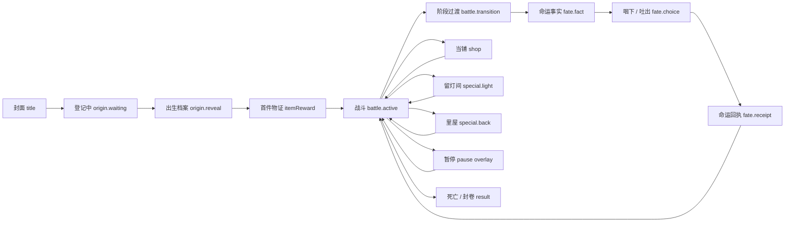

# 《这一身》UI 设计规范 v1

> 依据：`docs/这一身百科.html`、`src/types.ts`、`src/game.ts`、`src/style.css`  
> 范围：只定义 UI 叙事、布局、视觉、交互、声音与实现映射；不改变玩法规则。  
> 版本目标：先统一 MVP 全流程，再为完整八章人生保留扩展位置。

## 0. 一句话结论

《这一身》的 UI 应该像一份在一生中被不断填写、折叠、盖章、夹入新物证的人生档案，而不是一套奇幻卡牌框、霓虹 HUD 或复古报纸皮肤。

“档案”是信息组织逻辑，不是装饰素材：出生是登记表，命运是无法撤回的入档事实，道具是物证，商店是典当清单，结算是封卷。战斗中档案退到画面边缘，只留下安静、准确、能一眼读懂的生存信息。

命运牌是全游戏唯一可以占据屏幕中央的“牌”。其他页面不得继续复制三张大卡并套入另一张大卡。

## 1. 正典提炼

### 1.1 根命题

> 事情是改不了的，怎么做是可以选择的。

UI 必须持续区分两类信息：

- **已经发生的事实**：使用盖章、落字、划入档案、不可撤回的物理动作；玩家不能关闭、重抽或装作没看见。
- **仍然可以选择的回应**：使用方向、移动、拿取、放下、咽入与呼出等动作；不使用善恶、正确错误或红绿评分。

因此，UI 的核心动词不是“确认”和“取消”，而是“穿上”“带走”“咽下”“吐出”“交出”“留下”“继续走”。

### 1.2 世界观对应的界面物件

| 游戏对象 | 正典含义 | UI 载体 |
| --- | --- | --- |
| 出生 | 第一件无法选择的事 | 出生登记页、指印、编号、外号字章 |
| 怪物 | 困难正在发生时的形态 | 战场实体，不额外套怪物卡框 |
| 命运牌 | 已发生、不可撤销的事实 | 单张中央纸页，先盖“已发生”章再出现回应 |
| 道具 | 困难被背在身上后的形态 | 物证标签、穿戴剪影、构筑边注 |
| 一口气 | 被一生反复揉捏的唯一攻击 | 月白核心、劲/速/程三项索引、变形痕迹 |
| 五毒 | 反复选择后形成的执念 | 战时只身体化暗示，结算才揭示具体倾向 |
| 商城 | 愿意拿什么交换 | 没有招牌的当铺、货架、价签、典当小票 |
| 留灯间 | 被爱过的证据 | 真实房间、暖灯、桌面上的三件物品 |
| 里屋 | 透支自己的交换 | 冷白灯、脏帘、镜中老去的身体、代价刻度 |
| 结算 | 一生封卷 | 档案封皮、经历索引、最后一口气 |

### 1.3 八章人生的界面材质

完整数据与视觉必须支持八章；MVP 六阶段只是合并展示，不能把 UI 结构写死为六格。

| 章节 | 界面边注与材质 | 时间声音 | MVP 映射 |
| --- | --- | --- | --- |
| 降生 | 出生证明、腕带孔、指印、病房蓝灰 | 布料、远处推车、第一口呼吸 | 并入童年开场 |
| 童年 | 练习本横线、铅笔压痕、掉落纽扣 | 木床轻响、远处雨声 | 阶段 1 |
| 少年 | 作业格、红叉、被擦花的姓名栏 | 粉笔、下课铃尾音 | 阶段 2 |
| 青年 | 车票齿孔、时间戳、折叠地图 | 站台广播残片、齿轮 | 阶段 3 |
| 成年 | 家庭账本、租约折痕、未接来电角标 | 雨、门锁、短促电话震动 | 阶段 4 |
| 中年 | 表格网线、工牌孔、体检单箭头 | 荧光灯、电梯、打印机 | 阶段 5 |
| 老年 | 病历索引、褪色墨、缺失姓名 | 缓慢呼吸、空房间回声 | 并入暮年 |
| 死亡 | 封卷线、熄灯登记、月白空页 | 最后一口气、灯绳轻响 | 暮年末段 |

材质随人生渐变，但核心布局位置不漂移。玩家应感到档案在变旧，而不是每章换了一套 UI 主题包。

### 1.4 主题句的使用纪律

主题句只在关键节点出现，一次只出现一句。不得把正典解释成常驻教程或首页卖点列表。

| 节点 | 允许使用的句子 |
| --- | --- |
| 标题封面 | “这一生，最后都穿成了这一身。” |
| 出生档案封底 | “玩家不能选择从哪里开始，只能决定后来怎样面对。” |
| 首件道具 | “每一件道具，都是他活过的证据。” |
| 命运牌首次出现 | “事情是改不了的，怎么做是可以选择的。” |
| 最终结算 | “他没有赢，只是终于松了这一口气。” |

其余主题句进入低频章节转场或结算档案，不在战斗 HUD 循环播放。

## 2. 设计命题与禁区

### 2.1 设计命题

1. **人生先于系统。** 玩家首先看到“发生了什么”，然后才看到数值如何变化。
2. **所有变化有出处。** 属性变化能追溯到出生、命运或某件穿戴物；详细账目收在可展开档案里。
3. **事实有重量。** 盖章、折叠、压痕和物件落台都表达不可撤销，不靠警告弹窗制造重量。
4. **选择无道德配色。** 咽下与吐出都包含力量和代价；两侧亮度、面积和反馈必须对称。
5. **战斗让位给身体。** 战场中心优先显示主角、怪物、弹道和掉落物。UI 不得盖住主角周围的读招区。
6. **像素是结构，不是滤镜。** 所有线、位移、缩放、折叠和图标都落整数像素；不在高清 UI 上后贴噪点冒充像素风。
7. **黑色幽默保持平静。** UI 不替文案笑，不使用夸张表情、彩带、爆闪或搞笑音效解释梗。

### 2.2 禁区

- 不做营销式首屏：不列“自由走位 × 人生构筑 × 自动索敌”，不显示“每局随机、约 10 分钟”等卖点。
- 不做卡片套卡片：奖励、商店和房间使用货架、分隔线、物证标签或空间摆放，不把每件物品塞进厚重面板。
- 不做羊皮纸、金边、哥特花纹、魔法符文等通用奇幻装饰。
- 不做玻璃拟态、霓虹描边、紫蓝渐变、发光大按钮、圆角胶囊和悬浮卡片阴影。
- 不使用连续渐变。光照和材质用有限色阶、棋盘抖动或像素块过渡。
- 不把绿色等同收益、红色等同代价；用 `+/-`、标签“得到/留下”与位置区分。
- 不在战斗中常驻显示五毒数值，也不在命运选择后弹出“贪+1”之类人格评分。
- 不向玩家显示“AI 生成中”“GPT”“本地保底”“生成来源”等工程状态。
- 出生失败不得塞入兜底人物。等待和重试可以被演出包裹，但不能伪造一份出生档案。
- 不用巨大章节标题遮住战场，不用伤害数字雨和满屏状态文本抢过弹道。
- 不把主角立绘关进装饰卡框；角色是第一视觉对象，不是装备预览小图。

## 3. 全流程与界面状态



暂停是覆盖层，不应替换正在进行的主状态。阶段转场也优先作为 `battle` 的子阶段，以保持世界、角色位置和地貌连续。

## 4. 逐屏设计

### 4.1 开场 / 封面

**目标：** 让玩家直接进入“这一生”的仪式，不解释游戏类型。

**信息层级：**

1. 游戏名《这一身》；“身”保留日后向“生”过渡的结构。
2. 一句主题句：“这一生，最后都穿成了这一身。”
3. 唯一主动作：“开始这一生”。
4. 右上角只放声音、辅助设置两个图标；桌面悬停、移动端长按显示名称。

**画面：** 深墨底上放一张未展开的档案封皮。主角不是站在血月海报前，而是以 40×56 的初始空身像素剪影站在封皮外，身后只有月白呼吸留下的一小点。标题像被铅字压进封皮，旧红只用于“身”字的一笔或封卷章。标题页可以暗，但不得把这种明度复制到持续战斗地图。

**交互与动效：** 点击后封皮向内翻开，第一口吸气开始；按钮不弹跳，只在按下时下沉 1 像素并留下浅压痕。首次交互同时发起出生生成请求。

**不显示：** 玩法卖点、时长、随机种子、移动教学、版本号。

### 4.2 AI 无感生成 / 登记中

**目标：** 用出生登记演出覆盖等待，绝不让玩家盯加载条。

**安全演出序列：**

1. 0.0–0.7 秒：黑场里出现第一口呼吸；档案页边从底部推入。
2. 0.7–1.8 秒：打印“出生登记”，盖一个空白指印框；这些是固定结构，不伪造人物内容。
3. 1.8–3.2 秒：姓名、家庭、身体、外号四个栏位依次出现，但内容保持点线或被纸条遮住。
4. 3.2 秒以后：翻动背页、移动尺规、压下空章，形成可无缝循环的 4 秒环境演出。
5. 数据到达后：先显身体轮廓，再显故事，再显外号和特质缘由，等待自然转入出生档案。

**等待文案：** 只允许世界内语言，例如“登记的人还没把这一页递回来”“他的第一件小事，还在纸背后”。不出现 AI、模型、网络、重试次数或百分比。

**失败策略：** 后台静默重试。长时间仍无结果时，页面保持真实空白，不生成替代人物；可在 30 秒后露出一个不破坏沉浸的动作“把这一页重新摊开”，但仍不得开始假人生。

**跳过规则：** 数据未到达时不能跳过。数据已到达后，玩家可以跳过逐字演出，直接展开完整档案。

### 4.3 出生档案

**目标：** 玩家先认识“这个人”，再理解他的初始数值。

**信息层级：**

1. 三段式出生故事，每段对应家庭、身体/环境、最早经历。
2. 正面初始人偶与 AI 受控外貌；身体轮廓随故事逐层完成。
3. 外号及具体来由；外号字章在此首次被盖下。
4. 出生轮廓：普通人 / 有得有失 / 被命运偏爱 / 从缺口开始。
5. 特质因果账：`故事中的一句具体事实 → 属性变化`。
6. 主动作：“带着这副底色出门”。

**版式：** 一张完整档案页，不再额外套故事面板和特质卡。桌面左 58% 为正文，右 42% 为人物与字章；手机上先人物和外号，再故事，底部是一条可横向展开的因果账。

**普通人表现：** 不写“无 BUFF”。写“出生那天，一切都是 1”，并把所有基准值以淡墨 `1.00` 一次性列出。

**因果账示例：**

```text
早点摊收摊后，总有人给他留蛋花汤。
最大生命  1.00 → 1.06
```

### 4.4 战斗 HUD

**目标：** 三分之一秒内读到生存信息；三秒内可以展开构筑出处；默认不遮角色。

**常驻信息：**

- 左上：生命条与数值；有护盾时在生命条下增加 2 像素雨衣黄薄条。
- 顶部中间：当前年龄/章节；Boss 出现时替换为 Boss 名和生命条。
- 右上：零钱图标与数量、暂停图标。命运次数不常驻。
- 左下：外号字章和最多两个出生特质方向标；点击展开出生因果账。
- 底部靠中但避开控制区：《一口气》只显示 `劲 / 速 / 程` 三个相对值；发生临时异常时对应字段短暂盖章。
- 右下或右侧边缘：最近 6 件物证的小图标索引；超过 6 件以页角数字表示总数，点击展开整身档案。

**不常驻：** 五毒数值、所有道具名称、完整伤害公式、命运次数、种子、玩法组合长句。

**信息优先级：** 生命危险 > Boss/特殊门方向 > 阶段 > 零钱 > 一口气偏移 > 道具索引。任何临时提示不得同时占用两层以上。

**战场安全区：** 主角中心半径 72 逻辑像素内，不出现文字、Toast、任务框或方向提示。受伤只用短促边缘旧红压痕和呼吸声，不整屏红闪。

**五毒表现：** 战斗中只通过身体、影子、拾取半径、弹道行为和边注污染逐渐显形。例如贪高时零钱会在字章边缘留下向外伸的细线，但不写“贪 7”。

**移动：** 桌面不显示摇杆；手机摇杆仅在触摸时出现，且与触点绑定。攻击自动索敌，不增加攻击按钮。

**移动端实现约束：** 手势原点跟随真实落点，摇杆底座只在 `x=42..318, y=104..548` 的安全区显示；输入向量按半径 46 圆形限幅，摇杆帽按半径 24 显示，不能越出底座。HUD 必须绘制在摇杆之上。右上暂停及暂停页内控件的实际命中区不得小于 44×44 逻辑像素，视觉图标可保持更小。

**桌面端实现约束：** 保持同一套 9:16 逻辑画布，不把战场横向拉伸；在 `700px` 以上且高度充足时按可用高度放大，宽度上限为 `456px`。桌面不能退回 `360px` 原始逻辑宽度，否则正文与 HUD 会显得过小。两侧空间只承担夜间档案桌背景，不新增脱离主流程的面板。

### 4.5 阶段转场

**目标：** 玩家仍在跑，但明确感到自己长大了一次。

百科要求 15–20 秒过渡带。推荐分为三段：

1. **旧章褪去（5 秒）：** 怪潮变稀，旧地貌色块和物件减少；HUD 章节字变淡。
2. **事实落账（5–8 秒）：** 地图仍可移动，页面边缘出现下一章索引和一句入场句；身体比例与姿态逐像素改变。
3. **新章长出（5 秒）：** 新地貌物件从角色行进方向长出；章节索引盖章完成，需要命运事件时再无缝插入命运牌。

章节名最多占顶部 20% 高度，不做全屏大标题。转场句像页边手写注释，出现后留一道淡压痕进入本局档案。

MVP 可先保留 3.4 秒逻辑计时，但视觉结构必须按三段实现，后续只延长时长而不重做版式。

### 4.6 命运牌

**目标：** 让玩家清楚“事实已发生，回应仍可选择”，而不是从两张技能卡中挑收益。

**阶段 A：事实。** 单张纸从上方落入中央，先显示事件标题和事实正文。不可避免的生命、零钱、最大生命或物件变化立即盖在右下角，章文为“已发生”。

**阶段 B：回应。** 事实停留约 0.7 秒后，纸页左右边缘分别露出“咽下”和“吐出”的抓手。两侧都显示：回应名、真实动机、机械收益、真实代价、最多 3 项明账属性。五毒变化保持隐藏。

**阶段 C：提交。**

- 左滑咽下：纸页向中间折入，声音变闷，月白核心短暂进入主角胸口。
- 右滑吐出：纸页被气流推出，边缘向外翻，月白核心向战场外扩散。
- 两种动作持续时间、振动强度、字重相同，不做成功/失败音效。

**阶段 D：回执。** 不再显示另一张大卡。屏幕下部出现一条窄的“命运回执”，记录他说了什么、留下什么和属性明账；约 1.1 秒后允许继续。AI 后续回响进入战斗页边字幕。

**亲口回应的等待保护：** 玩家说出口后先保留在原事实页，不显示模型、网络或进度状态。等待超过 4 秒时露出动作“不等回声了”；点击它或按 `Esc` 只取消这次自由回应，原事件与已发生事实保持不变，并重新开放“咽下 / 吐出”。迟到的旧请求必须失效，不能覆盖玩家后来做出的选择。

**亲口回应：** 使用纸页底部的铅笔图标打开原生文本输入，限制 24 字。输入时事实正文仍可见。提交后界面先显示“这句话已经说出口”，再等待结果；不得出现模型状态。

**方向可读性：** 咽下用病房蓝灰细边，吐出用旧红细边，但两者面积、明度和饱和度必须相当；决定主要靠方向与折叠动作，不靠颜色判断。

### 4.7 道具奖励

**目标：** 同屏比较三件物证，先看玩法变化，再读讽刺意味。

**信息层级：**

1. 独立像素物件和名称。
2. 穿到主角身上会改变什么；每条记录内放一尊由运行时真实叠装系统绘制的试穿人偶，不使用预烘焙假预览。
3. `得到` 与 `留下` 两条机械信息；不用正负道德色。
4. 品级与一句物件原话。

**桌面：** 三座并列物证台，之间只用竖向档案分隔线。每件物证旁保留一尊同比例试穿人偶，直接呈现“现有穿戴 + 候选物”的最终外貌。

**手机：** 三件物证纵向排列成三条完整记录，每条约 140–156 像素高，三件和三尊试穿人偶必须同屏可比较；任何交互都不能把其他两条推走。

**选择反馈：** 物件从台上落到主角锚点，标签被订进“这一身”索引。没有稀有度烟花和胜利音。

### 4.8 商店 / 没有招牌的当铺

**目标：** 看起来是一次交换，不是 Roguelite 商城模板。

**布局：** 三件物品直接摆在同一组连续货架上。每层左侧是物件与运行时试穿人偶，中部依次放名称、讽刺文案和机械效果，右上只留一张纸质价签；零钱固定在柜台账本右上角。奖励页使用档案角花，当铺只使用木质层板和针孔价签，二者不得复用同一种容器轮廓。

**动作：**

- 购买：拿起物件，零钱落入铁盒；整层陈列降暗，价签被撕成“已撕”，保留空过一次的交易痕迹。
- 重整：使用熟悉的循环箭头图标，旁边显示成本 `2`；新一批记录按货架顺序分步落下，不使用卡包闪光。
- 离开：使用门形图标，不做一块与购买同权重的大红按钮。

购买失败只让钱盒空响一次并晃动价签 1 像素，不弹模态框。

### 4.9 留灯间

**目标：** 让“被爱过”成为空间经验，而不是金色天使商店。

房间本身全屏出现：一盏暖黄桌灯、一只还有余温的锅、无人坐的椅子。三件物品分别落在桌面、椅背和门边，不放进三张卡。只有靠近或选中时，物件旁展开一条短标签。

常驻文字只保留房名和“只能带走一件”。没有价格、倾向分、NPC、祝福粒子或圣洁音乐。选中时只听到布料、碗沿或电梯按钮等物件自己的声音。

带走后，另外两件不碎裂，只在灯下安静留着；离开时门从身后合上。

### 4.10 里屋

**目标：** 展示可理解的强力交换，不把它画成“邪恶房”。

全屏空间由冷白荧光灯、脏帘子和镜子构成。镜中主角比本体老一个年龄阶段，并实时显示每次支付后的身体缺口。三件物品放在金属托盘或挂钩，不进卡框。

每件物品旁用身体刻度明确写代价，例如：

```text
断掉的脊梁骨
得到：每条负面词条增伤
交出：12 最大生命；永久弯腰
```

玩家可拿多件。每次拿取前，镜中先预演缺口；按住 0.6 秒完成交换，防止误触。代价使用旧红盖印，但物品本身不做红色邪气发光。

底部不显示“空肺/窗灯倾向”等系统值。什么也不拿时，动作写“掀帘出去”，而不是“取消”。

### 4.11 暂停 / 档案暂存

**目标：** 提供完整控制和构筑查询，同时保持世界像被暂时夹住。

暂停时战场冻结并降低到 35% 明度，一张半透明复写纸从右侧盖住约 42% 画面。桌面按 `Esc`，手机使用右上角暂停图标；命运牌阶段也可暂停，但不能借暂停撤回已越过阈值的选择。

**一级动作：** 继续。  
**二级动作：** 这一身、出生档案、命运回执、设置。使用页签而非页面内嵌卡。  
**危险动作：** 结束这一生；需按住 1 秒，之后再显示一句具体后果“本局档案会封存为未完”。

**设置至少包含：** 总音量、音乐、环境声、提示声、振动、减少动态、文字大小、高对比、左手摇杆。二元设置使用开关，音量使用滑杆，页签使用图标加短标签。

### 4.12 死亡与通关结算 / 封卷

**目标：** 先让玩家看见“他成了什么样的人”，再看统计。

**首屏层级：**

1. 穿着整局物件的最终主角，全身无遮挡。
2. 本局姓名/外号、走到的年龄、结束地点。
3. 一句由经历生成的封卷句；失败不做嘲讽，通关使用“他没有赢，只是终于松了这一口气”。
4. 一项最具代表性的构筑组合或尚未命名的一生。
5. 本局最深两项五毒，第一次明确揭示，并解释它们如何从具体选择形成；不写善恶评级。

**后续页签：** `穿过的`（道具时间线）、`咽下/吐出`（命运回执）、`留下的`（击杀、伤害、零钱等统计）。这些是同一档案的三页，不是三张嵌套卡。

**通关闭环：** 标题“这一身”的“身”逐像素擦去下半部并补成“生”，随后盖下封卷章。  
**未通关闭环：** 保留“这一身”，在章节索引旁盖“写到这里”，不使用 Game Over。  
**再开一局：** 主动作“再活一次”；种子与技术统计收在次级详情，不占首屏。

## 5. 统一像素 UI 规格

### 5.1 画布与响应式布局

采用两套确定的逻辑布局，不把 9:16 界面直接拉伸到 16:9。

| 目标 | 逻辑画布 | 典型放大 | 用途 |
| --- | --- | --- | --- |
| 1920×1080 桌面 | 640×360 | 3× 最近邻 | 16:9 战斗与宽屏信息页 |
| 手机竖屏 | 360×640 | 最近邻铺满可用宽度，最大 430 CSS 像素 | 单手移动、三项纵向比较 |

基础空间单位 `u = 2` 逻辑像素。边距、间隔、线宽、图标尺寸与动画位移优先使用 `u` 的整数倍。角色 40×56、脚底根点 `(20,49)` 的正典规格保持不变。

桌面战斗安全区：`x=48..592, y=32..324`。  
手机战斗安全区：`x=12..348, y=58..548`；底部 92 像素保留给触控、字章和一口气索引。

### 5.2 色板

| Token | 色值 | 用途 |
| --- | --- | --- |
| `ink-night` | `#111014` | 夜色主背景 |
| `ink-paper` | `#1A181B` | 暗纸与非战斗底 |
| `paper` | `#E9E3D4` | 主文字、月白核心、亮纸 |
| `paper-aged` | `#D9D1BE` | 次级文字与旧纸 |
| `ink-muted` | `#6E675B` | 说明、失效状态 |
| `rule` | `#514B43` | 分隔线、折痕 |
| `old-red` | `#9E3B33` | 已发生章、生命、不可逆代价 |
| `rain-yellow` | `#A8842F` | 灯、护盾、被爱过的证据 |
| `ward-blue` | `#63737B` | 咽下、病房、冷静信息 |
| `worn-green` | `#6F8578` | 恢复与关系痕迹，低饱和使用 |

单个画面除纸色与墨色外，只允许一种高注意力强调色。收益与代价仍必须用文字和符号辨认，不能只依赖颜色。

### 5.3 字体与字号

- 游戏内正文使用预打包中文点阵字库，优先 12×12 / 14×14 两档；发布前单独核验商用许可。
- 主题句与封卷句可使用宋体骨架的点阵标题字，但仍渲染到整数像素格。
- 数字使用等宽字形，`1.00` 不因数值变化造成 HUD 抖动。
- 禁止负字距。标题和紧凑面板不随视口宽度连续缩放字号。

| 层级 | 桌面逻辑字号 | 手机逻辑字号 | 用途 |
| --- | ---: | ---: | --- |
| 微标 | 6–7 | 10 | 编号、年龄索引 |
| 标签 | 8 | 11 | HUD、价签、短状态 |
| 正文 | 9 | 12 | 故事、效果、事实 |
| 小标题 | 12 | 15 | 物品名、事件名 |
| 主标题 | 20–24 | 24–28 | 仅封面与结算 |

移动端正文目标不低于 12 CSS 像素的视觉尺寸；MVP 第一轮先消除 7px Canvas 字号，并将高频信息提升到 8–13 逻辑像素。长词必须换行，不挤压图标或相邻信息。

### 5.4 边框、纸张与盖章

- 结构线 1 像素，选中线 2 像素，危险确认线 2 像素旧红。
- 圆角 0–2 像素；不得超过 4 像素。
- 不使用模糊阴影。需要层次时，使用向右下偏移 2 像素的纯色复写层。
- 一屏最多一张完整纸页；纸页内部使用分隔线和栏位，不再套小卡。
- 盖章只表达“已发生、已穿上、已支付、已封卷”四种不可逆动作。
- 折痕只表达状态变化；装饰折痕不得重复铺满背景。

### 5.5 图标

- 基准 12×12 与 16×16 两档，1–2 像素描边，最多 3 个内部色。
- 暂停、声音、设置、返回、刷新、门、铅笔使用熟悉符号；不在符号外再套文字胶囊。
- 不熟悉图标在桌面悬停 350ms 显示名称，手机长按显示名称。
- 道具图标属于物证，不强制使用 UI 单色；但所有道具共享相同透明边距和投影基线。

### 5.6 动效

- 游戏逻辑可保持 60fps；UI 位移与帧变形以 6/8/12fps 阶梯采样，避免平滑高清漂移。
- 微反馈 80–120ms；页签 160ms；盖章 220ms；折页 300–420ms；命运出牌 550–750ms。
- 所有平移、旋转中心与缩放终点取整数像素。旋转只用于命运牌，最大约 4°；普通面板不倾斜。
- 禁用弹簧、回弹、漂浮呼吸卡片、粒子彩带、镜头模糊与渐变溶解。
- “减少动态”开启时，折页改为 2 帧切换，屏幕震动与低血脉冲关闭，保留状态文本。

### 5.7 声音与触感

| 事件 | 声音提示 | 触感 |
| --- | --- | --- |
| 开始 | 一次轻吸气、封皮摩擦 | 单次轻触 |
| 档案落字 | 铅笔或打字机单键，低音量 | 无 |
| 盖章 | 干燥软木落桌声 | 短触 |
| 拿到道具 | 对应物件材质声，不播稀有度胜利音 | 品级只改变重量，不改变次数 |
| 咽下 | 纸向内折、闷住的呼气 | 向内一次中触 |
| 吐出 | 纸边翻开、短呼气 | 向外一次中触 |
| 低生命 | 呼吸变短，不播心跳警报 | 可关闭的间歇轻触 |
| 留灯间 | 锅盖、布料、室内远声 | 无 |
| 里屋 | 荧光灯嗡鸣、帘环摩擦 | 支付时一次重触 |
| 死亡 | 最后一口气、灯绳轻响 | 一次缓慢重触 |

提示声不能替代视觉信息。音乐、环境、提示、振动分别可调。

### 5.8 可用性

- 所有移动端点击目标至少 44×44 CSS 像素，即使图标本身只有 16×16。
- Canvas 上的关键控件应有同步 DOM 语义层，支持键盘焦点、读屏名称和原生文本输入。
- 信息不只靠颜色表达；生命、成本、选择方向均有文字或形状冗余。
- 命运牌支持拖动、方向键与明确焦点选择，但无“撤销已发生事实”。
- 安全区适配刘海、圆角、底部手势条；触控 HUD 不能紧贴物理边缘。

## 6. 线框

### 6.1 1920×1080 / 逻辑 640×360：战斗

```text
┌──────────────────────────────────────────────────────────────────────┐
│ HP ███████░ 68/80       少年 · 千眼教室             ◈ 12    ⏸     │
│                         统一答案 ███████░                            │
│                                                                      │
│    ·门方向                                                   摊位·   │
│                                                                      │
│                              怪                                      │
│                    怪      一口气 →     怪                           │
│                              人                                      │
│                                                                      │
│                 （主角半径 72 内无任何文字 UI）                      │
│                                                                      │
│ [兜] ↑↓                劲 1.18  速 0.92  程 1.06      物证 6/14 ▣   │
└──────────────────────────────────────────────────────────────────────┘
```

桌面 HUD 是四个贴边索引，不是上下两条全宽黑带。Boss 出现时顶部中间的章节副标题让位于 Boss 血条。

### 6.2 1920×1080 / 逻辑 640×360：出生档案与命运牌

```text
┌──────────────────────────────────────────────────────────────────────┐
│ 出生登记 · 0001847                                      [字章：兜]  │
│ ───────────────────────────────────────────────────────────────────  │
│ 他出生在……                              ┌──────────────┐             │
│ 后来……                                  │              │             │
│ 因为小时候……                            │   初始人偶   │             │
│                                          │              │             │
│ 外号《馒头兜》                           └──────────────┘             │
│ 早点摊总有人留蛋花汤  → 最大生命 1.00→1.06                           │
│                                            [带着这副底色出门]         │
└──────────────────────────────────────────────────────────────────────┘

┌──────────────────────────────────────────────────────────────────────┐
│                                                                      │
│      咽下 ←      ┌────────────────────────────┐      → 吐出          │
│                  │          已 发 生           │                      │
│                  │ 《名单上有你的名字》       │                      │
│                  │ ……无论怎么选，他都失业了。 │                      │
│                  │                            │                      │
│                  │ 先别告诉家里  | 问清楚补偿 │                      │
│                  │ 明账变化          明账变化 │                      │
│                  └────────────────────────────┘                      │
│                              ✎                                       │
└──────────────────────────────────────────────────────────────────────┘
```

### 6.3 手机竖屏 / 逻辑 360×640：战斗

```text
┌──────────────────────────────────┐
│ HP █████░ 68/80   少年    ◈12 ⏸ │
│             统一答案             │
│                                  │
│       ·门                        │
│                                  │
│               怪                 │
│         怪  ← 一口气             │
│               人                 │
│                                  │
│                                  │
│                 怪               │
│                                  │
│ [兜] ↑↓        物证 6/14 ▣       │
│ 劲 1.18  速 0.92  程 1.06        │
│              （触摸时出现摇杆）  │
└──────────────────────────────────┘
```

右上暂停点击区扩大到 44×44，但图形仍保持 12×12。字章、物证索引和一口气数值位于底部安全带，虚拟摇杆按触点临时出现，不占固定槽位。

### 6.4 手机竖屏 / 逻辑 360×640：三选一与命运牌

```text
┌──────────────────────────────────┐
│ 离开家门时，他只带走一件东西    │
│ ───────────────────────────────  │
│ [图] 石头书包                   │
│      得到：穿透与重量            │
│      留下：移动变慢       [人影] │
│ ───────────────────────────────  │
│ [图] 前桌的情书                 │
│      得到：追踪                  │
│      留下：弹体变轻       [人影] │
│ ───────────────────────────────  │
│ [图] 小一号校服                 │
│      得到：更快                  │
│      留下：身体被勒紧     [人影] │
└──────────────────────────────────┘

┌──────────────────────────────────┐
│             有件事发生了         │
│                                  │
│   咽下  ┌──────────────────┐ 吐出│
│    ←    │     已 发 生      │   → │
│         │《名单上有你的名字》│    │
│         │ 事实正文……       │     │
│         │                  │     │
│         │ 回应与明账变化   │     │
│         └──────────────────┘     │
│              [✎ 亲口说]          │
│                                  │
└──────────────────────────────────┘
```

三项纵列保证同时比较；不使用横向轮播隐藏其他选项。命运牌占据中央，拖动区域覆盖整张纸，底部输入入口避开系统手势条。

## 7. 现有代码审计与映射

### 7.1 当前状态流

`src/types.ts` 目前只有：

```text
title → origin → itemReward → battle
                         ↘ shop ↗
                         ↘ specialRoom ↗
                         ↘ fateEvent → battle / advance / shop
battle → result
```

暂停已作为正交覆盖层接入，不替换原始 `ScreenState`；阶段转场仍依赖 `battle + transitionTimer`，出生、命运和结果各自在单一状态中用多个布尔量表达子阶段。

### 7.2 函数级映射

| 规范页面 | 现有状态 / 函数 | 保留 | 必须调整 |
| --- | --- | --- | --- |
| 封面 | `title` / `renderTitle()` | 标题、初始人偶、开始动作 | 删除玩法卖点与时长；从血月海报改为档案封皮 |
| 登记中 | `origin` / `renderOriginLoading()` | 等待期间有演出 | 去掉同心圆加载器与“AI正在生成”；改为空白登记页循环 |
| 出生失败 | `origin` / `renderOriginError()` | 不使用兜底人物 | 后台静默重试；长等待动作改成世界内语言 |
| 出生档案 | `origin` / `renderOrigin()` | 故事、外号、人偶、特质 | 从多个面板改为一张完整档案；特质改成故事因果账；隐藏来源标签 |
| 首件/普通奖励 | `itemReward` / `renderItemReward()`、`drawItemChoice()` | 三选一、不可跳过、正负效果、逐项运行时试穿、分步落装与归档反馈 | 已完成；后续只按实机继续校准体型变化可读性 |
| 战斗 | `battle` / `renderBattle()` | 世界优先、自动攻击、外号字章、贴边 HUD、Boss 顶栏接管、最近屏外威胁提示 | 后续补完整“这一身”抽屉与音频反馈 |
| 一口气 HUD | `renderBattleOverlay()` | 相对基础值的构筑表达 | 劲/速/程常驻；穿透、回返、追踪、分裂与范围伤害用短标签显示 |
| 出生字章 | `renderOriginBadge()` | 外号取字、出生缘由可展开 | 保留；扩展页改成复写纸侧页，不遮主要战场 |
| 五毒 | `renderBattleOverlay()`、`renderPoisonStrip()` | 内部数值仍可供系统计算 | 战斗和命运界面隐藏数字；结算新增揭示页 |
| 阶段转场 | `beginStageTransition()`、`transitionTimer`、`renderWorld()` | 世界连续渐变、主角始终可见 | 已完成：15 秒环境预变 + 4.2 秒人生片段与生活物件接棒，不切黑屏 |
| 命运等待 | `fateEvent` / `renderFateEvent()` 无事件分支 | 异步等待与预取 | 不显示 AI、超时、本地保底；用事实纸未落字的演出 |
| 命运选择 | `renderFateEvent()` | 单牌、左右滑、明账属性、自定义回应 | 先盖“已发生”；两侧对称；牌面去掉生成来源 |
| 命运结果 | `renderFateResultCard()` | 窄回执、事件索引、回应、后果、机械变化；五毒增量不显示 | 已完成；后续只按实机校准停留节拍 |
| 当铺 | `shop` / `renderShop()` | 三件、价格、逐项试穿、共用货架、纸质价签、零钱落盒、撕签、失败空响与重整落页 | v2 当铺背景已接入并降低黑幕；后续只校准动效节拍 |
| 留灯间/里屋 | `specialRoom` / `renderSpecialRoom()` | 两类实体房间、独立物证台、共享身体预览、按住交换、不同代价；内部倾向已隐藏 | v2 背景与物证台已接入并通过移动端复核；补齐更细代价预演 |
| 暂停 | `paused` / `renderPauseOverlay()` | 原位冻结与恢复、构筑/出生/命运页签、总音量滑杆、振动、减少动态、高对比、按住退出 | 补齐音乐/环境/提示分层、文字大小和左手摇杆 |
| 结算 | `result` / `renderResult()` | 最终人偶、年龄进度、五毒形成说明、物证/命运/统计页签、再活一次、分步“身→生” | 后续可补充由整局经历生成的个性化封卷句 |

### 7.3 现状与正典冲突

1. 阶段转场已拆成 15 秒环境预变与 4.2 秒正式落款：先交代现实处境，再给主角心声，最后由生活物件接棒；地面、摆设和光线连续换代，混合进度不再回跳，旧版 88% 黑幕已移除。
2. 奖励、当铺和两扇门已拆成档案记录、当铺货架、暖屋托盘/冷屋挂钩三种结构；奖励与当铺已使用真实叠装试穿人偶，后续继续加强体型变化的可读性。
3. 当前固定 360×640 画布，没有 16:9 桌面布局分支；桌面仍以居中竖屏运行。
4. 7px Canvas 正文字号已清除，战斗 HUD、命运、奖励、当铺、特殊房和结算的高频信息已完成首轮放大；8–9px 次级文字仍需逐页实机复核。动态摇杆已加入安全区、圆形限幅与 HUD 遮挡纪律，暂停/设置触控命中区已扩到至少 44px。
5. 暂停、程序化关键音效、总音量、振动、减少动态、高对比和基础档案查询已接入；音乐/环境/提示分层和左手摇杆仍缺失。
6. 奖励落装与归档动画已接入；当铺已接入零钱落盒、价签撕落、失败空响与重整落页，二者均遵守像素分步节拍。
7. 战场不再加载循环地砖；青年关纵横站台刻线已换成零散磨损。章节底色稳定在屏幕层，摆设与磨损才随世界坐标移动。
8. 弹体 UI 与渲染遵守“一颗弹一个 form、一种 tail、多组 mechanics flags”；不得用多张完整弹体贴图表现道具叠加。
7. 旧版五张全屏转场插画因过暗且打断连续地图，已降为归档；六章摆设、批改痕命中与“标准之外”敌人仍保持审阅态，未经静态确认不得进入运行时。

## 8. 分阶段实现建议

### P0：视觉底座与响应式壳

- 建立色板、字号、间距、线型、图标和动画 Token。
- 将当前单一 `360×640` 坐标拆为 `640×360 desktop` 与 `360×640 mobile` 两套布局表。
- 先实现最近邻缩放、整数像素约束、安全区和文字最小尺寸。
- 保留现有玩法状态，先替换 `panel()`、`bar()`、`overlay()` 等基础绘制语言。

**验收：** 两个画布比例均无拉伸；文字不溢出；主角周围安全区无 HUD；截图颜色不出现连续渐变。

### P1：封面、无感生成与出生档案

- 重做 `renderTitle()`、`renderOriginLoading()`、`renderOrigin()`。
- 隐藏所有模型来源与工程状态；出生仍坚持无兜底人物。
- 把特质改为故事 → 数值因果账，完成外号字章的首次盖印。

**验收：** 断网时不会出现预设人物；正常生成时从等待演出自然过渡；玩家无需看“AI”字样也知道档案仍在登记。

### P2：战斗 HUD 与阶段转场

- 重排 `renderHud()`、`renderBattleOverlay()`、`renderOriginBadge()`、`renderCaption()`。
- 五毒从战时 UI 移除；一口气收敛为劲/速/程。
- 将 `transitionTimer` 明确为三段视觉子相位，先兼容现有 3.4 秒，再扩到正典时长。

**验收：** 360×640 最激烈战斗截图中，角色、怪物、弹道和门提示不被 UI 遮挡；玩家 0.3 秒能读生命和 Boss 状态。

### P3：命运、奖励、当铺与两扇门

- 命运加入 fact → choice → receipt 子阶段；移除来源和毒值。
- 三选一已使用逐项运行时试穿人偶与分步落装归档动画，替换复用的大卡面板。
- 当铺、留灯间、里屋已分别实现货架、暖屋、冷屋三种空间结构。

**验收：** 三处页面只看截图也不会混淆；命运两侧无明显“正确颜色”；奖励三件在手机同屏可比较。

### P4：暂停、封卷、声音与辅助

- 增加正交 `pause` 覆盖层，不破坏原始 `ScreenState` 返回位置。
- 结算已增加五毒首次揭示、命运回执、道具索引与“身→生”；后续补充个性化封卷句。
- 程序化关键音效、总音量、振动、减少动态和高对比已接入；继续补音乐/环境/提示分层、文字大小和左手摇杆。

**验收：** 暂停可从战斗和命运页进入并原位恢复；通关与死亡首屏叙事不同；关闭颜色后仍能辨认所有成本和选择。

## 9. 最终 UI 验收句

玩家截掉所有文字后，仍能从“页面被填写、事实被盖章、物件被穿上、房间被进入、最后档案被封卷”看懂这一局的一生；玩家只看战斗截图时，又不会觉得自己在一份表格里打怪。
